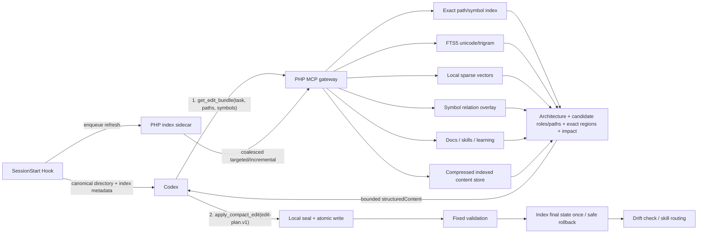

# Project Intelligence MCP

## 目标

Project Intelligence MCP 把代码库扫描、符号解析、知识检索、文档定位和机械编辑移到本地 PHP 进程中。Codex 负责理解意图、判断方案和生成小型结构化变更；MCP 负责把意图解析为精确位置、执行文件事务、验证结果并更新索引。

这能减少两类重复 Token：

- 不再把大批候选文件或完整文件发送给模型，由 `get_edit_bundle` 在本地排序并只返回可编辑的命中区域。
- 不再让模型输出完整文件或重复机械替换，由 `edit-plan.v1` 表达“修改哪个符号/章节以及替换内容”。

它不会绕过 Codex。MCP Server 本身不能禁用 Codex 自带的 Shell/Search 工具；个人插件因此在 `UserPromptSubmit` 前移强路由上下文，并由 `PreToolUse` 对已被 Hook 截获的直接读取执行审计和 `permissionDecision: deny`。官方仍说明 `unified_exec` 等路径拦截不完整，所以该层是“支持路径 Host deny + 其余路径模型级强制”，不是完整安全沙箱；索引过期、不可用或上下文不足时仍必须明确报告后才能有界回退。

## 架构



每个项目拥有独立数据库：

```text
~/.learning-mcp/
├── learning.db
├── index-sidecar.sock / index-sidecar.lock / index-sidecar-state.json
├── indexes/{project-hash}/project.sqlite
└── edit-journal/{project-hash}/{edit-id}/
```

`learning.db` 保存会话证据和经验；`project.sqlite` 保存可重建的代码/知识索引。两者分开，避免大型索引 WAL、清理和重建影响学习证据。

## 索引生命周期

首次索引仍然必须读取代码库。区别在于扫描只由本地 MCP 完成一次，后续 AI 请求查询持久数据库：

1. Codex 个人插件自动启动 MCP 与 `SessionStart` Hook。Hook 将 `cwd` 的规范化绝对目录直接作为项目边界，立即返回索引 DB/revision/freshness/counts 和路由契约，不返回代码正文。
2. Hook stdout 完成且关闭 Learning/Project SQLite 句柄后，请求投递到自动 PHP sidecar。sidecar 保持 SQLite 热连接，按项目合并 100ms 窗口内的刷新；不可用时退回一次性 fork。
3. 从当前规范化绝对目录建立受限文件系统目录，提前排除第三方、生成物、密钥、测试和大目录；非 Git 目录与 Git 目录使用同一发现路径。
4. 应用扩展名、大小、测试、第三方、生成目录、密钥和二进制排除规则。
5. 用 size/mtime/content hash 判断变化，只解析新增或变化文件。
6. PHP/PHTML 使用 `token_get_all` 提取 namespace、class/interface/trait/enum、method/function，以及 extends/implements/use/new/static/method/static/function-call 等保守词法关系。
7. Markdown 按 Heading 切分；普通文本按有界行块切分。
8. 同一事务更新文件、gzip 压缩的完整文本、Chunk、FTS、稀疏向量、符号、关系、技能和知识状态。每个 Chunk 默认只保留权重最高的 24 个稀疏词项；空间成本较高的 trigram 只覆盖 doc/rule/skill。
9. MCP 自己应用代码后立刻定点重索引；`PostToolUse` 跳过只读 Shell/MCP，从 `apply_patch` 提取 Add/Update/Delete/Move 路径，未知写入保守退化为整仓 incremental。默认 60 秒 freshness 校验仅兜底绕过 Hook 的外部编辑。

默认不索引 `.git`、`.gitnexus`、`.codex/code-intelligence`、`vendor`、`node_modules`、`generated`、`var`、静态产物、`view/tpl`、minified/source map、密钥文件和测试目录。测试目录不会进入普通全量目录索引；用户明确给出的合规测试文件会作为有界路径定点索引。

调用方明确传入的 `paths[]` 是有界授权范围：`get_edit_bundle` 每次都对全部显式路径读取当前内容并核对 Hash，在返回区域前立即刷新新增、修改或删除状态，不等待 60 秒兜底周期。目录枚举不读取 `.gitignore` 作为项目或索引边界；任何通过 `pathAllowed` 的合规文本文件都可进入当前目录项目索引。显式 `paths[]` 仍只定点刷新所给路径，不扫描其父目录。默认全量索引仍排除测试目录，但用户明确给出的测试文件会定点物化；密钥、二进制和生成目录等安全门禁仍然生效。

## Codex 路由门禁

- `UserPromptSubmit`：索引为 `current` 时注入一次性 bundle/write 契约，避免 SessionStart 上下文在长任务中被弱化。
- `PreToolUse`：识别 `Bash`、`functions.exec`、`apply_patch` 和文件读取工具中的目录枚举、`rg/grep/find/ls`、`cat/sed/head/tail`、直接编辑等路径；已知 Weline MCP 工具与验证命令直接放行，命中的受支持调用返回 `permissionDecision: deny`。
- 传输门禁：deferred-tool 包装必须转发 `result.structuredContent` 或镜像后的完整 `result.content`，不能只输出短回执并以原生单文件 Read 补偿。
- 合法例外：强制规则/Skill 全文、用户显式文件、未索引或排除材料、验证、MCP 明确 stale/unavailable/insufficient。Shell 使用 `WELINE_MCP_DIRECT_READ_REASON` 声明原因，审计只保存摘要 Hash。
- 模式：`WELINE_MCP_ROUTING_GUARD=enforce|audit|off`，默认 `enforce`。
- Host 边界：Codex 当前允许 `PreToolUse.permissionDecision: deny` 阻断已截获的 Bash、`apply_patch` 和 MCP 调用；官方同时说明 `unified_exec` 拦截仍不完整，WebSearch 和其他非 Shell、非 MCP 工具也不在此边界内。个人插件用 Prompt 强约束覆盖这些剩余路径；管理员 managed requirements 仍是不可关闭策略所需的更强配置层。

## 混合检索

单一向量检索不适合类名、路径和精确符号。候选排序按以下信号组合：

1. 从短查询和任务中的路径、FQCN、`Class::method`、类名、方法名提取精确词，再走带索引的等值匹配；只有规范大小写的 `Vendor_Module`/`Vendor/Module` 才拆成 `module_vendor + module_name` 复合索引条件，普通查询不再执行模块名拼接扫描。
2. FTS5 BM25；trigram 为中文子串、专有名词和无空格文本补召回。
3. 依赖无关的 Feature Hash 稀疏向量点积。索引内容仍保留最多 24 个特征；查询侧先生成最多 12 个高优先级特征，再通过 `chunk_vector_terms(term_hash, chunk_id)` 覆盖索引统计 posting 数，在动态 posting 预算内选择最多 8 个低扇出特征参与候选分组。高频词和 hash 碰撞不会再拖着数万 posting 进入主查询。它是本地词项向量，不是神经 Embedding。
4. extends/implements/import/new/static/method/static/function-call 等词法关系邻近度；动态方法调用以低置信度返回，不冒充类型解析结果。
5. 文件/模块/状态/新鲜度加权。
6. 只基于既存 `query_id + result_id` 的脱敏命中反馈；不保存原始 Prompt，也不把反馈变成政策。

`get_edit_bundle` 先返回 `architecture`、`candidate_paths`、`candidate_roles`、`coverage` 与 `continuation`，再返回精确 `regions[]`、文件/内容 Hash、行号、符号影响摘要和匹配 Skill。候选池在发现阶段默认扩大到 48–96 个结果，并按入口、视图模板、Provider/Query、Service、契约、配置、模型、工具协议、检索器、插件清单和文档等职责保证首批多样性；精确标识符与已知产品/模块别名获得额外权重，任务中的通用“修改”不再扩展为容易误命中业务 `edit()` 的词。显式 `symbols[]` 同时进入检索查询和批量影响分析，最多处理 24 个目标；批量影响不再只给计数，而会把三层词法上游图的具体相对路径并入候选清单。为防止 `Scope/Query/Config/Index` 等非显式通用符号把整个仓库拖入上下文，只有用户显式目标或非通用命中的上游路径会进入候选清单。请求 class/interface/trait/enum 时仍通过 `symbols_parent_idx` 同批补充成员实现。

已知 `paths[]` 时，服务端先从任务推断职责，再在路径共同模块/子树中执行有界文件名级角色发现；每个职责最多优先选两项，总数最多 24，扫描上限 20,000 路径项。测试目录仍不进入普通全量索引，但缺少 test 角色时允许合规测试文件进入这一次定点批次。用户路径与角色发现路径随后合并为一次 `server_aggregated_paths_refresh`，检索器用 `requested_paths` 单独保留用户授权/缺失判断，并按全部 materialization paths round-robin：路径级 SQLite 批次先按请求顺序为每个已命中路径锚定一个候选区域，再让语义分数补充其余区域，因此大型 Service/文档的重复高分 Chunk 不会把短入口、配置或测试挤出预算；区域始终受 48 个和 24,000 Token 上限约束。最终重新计算职责与维度，只有完整时返回 `ready_for_edit=true`；对 Codex 的 continuation path/search 数组清空并标记 `external_followup_allowed=false`。`server_aggregation.role_discovery`、`on_demand_index`、`routing.batch_request` 与 `performance` 回显内部发现、刷新、批次和耗时。

`repository` 正常必须是当前规范化绝对目录。若宿主漏传，只有同时提供非空 `paths[]`，且每个路径在 MCP 进程当前目录下 realpath 后仍是已存在的普通文件、没有绝对路径/`..`/符号链接越界时，服务端才使用 `process_cwd_validated_by_paths` 推断；结果通过 `repository_resolution` 审计。其他情况返回 `REPOSITORY_REQUIRED`，不会猜测 Git root 或父目录。

推荐协议是“单次需求分析 → 单次服务端上下文闭包 → 单份完整计划 → 单次原子 Apply → 单次集中验证 → 单次完整 Diff 审查”。AI 在调用前推断全部可能路径和符号；MCP 在一次 `get_edit_bundle` 内聚合架构、定义、调用链、契约、配置、测试、文档、消费者与 continuation。只有 `ready_for_edit=true` 才写入。Apply 后若索引发现新影响，返回 `impact_delta` 并以 `IMPACT_EXPANSION` 最多扩展深度 2；验证失败以 `VALIDATION_REPAIR` 最多修复 2 次；文件冲突以 `CONFLICT_REPLAN` 最多重规划 2 次；用户主动改范围使用 `USER_SCOPE_CHANGE`。未分类重复属于流程缺陷，同一错误第 3 次停止。全部状态保持单写者，不启用编辑子代理，不做 Shell 源码读取或直接写入。固定 `diff_check` 从事务 Journal 比较已校验 preimage/postimage，不依赖项目是否为 Git，也不受其他工作区差异影响。

## 自动学习技能投影

Learning SQLite 是经验真相源，Project SQLite 是路由、内容和当前项目知识的派生层。Stop/idle 提取先给候选标记 `global_rule`、`project_rule`、`skill_knowledge` 或 `operational_observation`；不应学习的内容返回 `discard`/`no_learning`。全局规则永不自动验证或落盘到全局配置；项目规则只留在项目经验层；技能知识进入 Skill；操作观察必须携带产品 surface 与环境约束。单一 Browser/OS/安全策略现象不能直接成为全局规则。

每条候选还必须具有一个具体正向示例和一个不同的负向示例。PHP 在状态转换前确定性校验分类、surface、环境、作用域、证据和双示例；不完整候选可用于审核，但不得自动验证或投影为 Skill。`LearningNoveltyService` 随后一次读取同项目 Experience，并在 Project SQLite 中有界查询代码、文档、规则、配置和技能；语义重复只合并 Evidence，已索引规则返回 `known_project_knowledge`，新增范围记为 enrichment，反向规则记录开放 Contradiction。

当一个项目中双示例完整的 `skill_knowledge`/`operational_observation` Experience 达到 `validated`/`promotion_eligible`/`promoted`、置信度达标、拥有证据、未过期且无开放冲突时，`sync_learning_skills` 执行：

1. PHP 固化项目、经验版本、知识类别、surface、环境、正反示例和当前投影指纹，生成幂等 Job。
2. 隔离的 `codex exec --ephemeral --sandbox read-only --ignore-user-config` 只对 Experience ID 分组，并返回与来源完全一致的 `knowledge_types`/`surfaces`；它不读仓库、不重写规则、不写文件。
3. PHP 从本地验证记录渲染含 Knowledge Type、Surface、Environment、Positive Example 和 Negative Example 的技能。`knowledge.learning_skills.output_directory` 留空时保持项目级 `dev/ai/skills/MCP学习-*/SKILL.md` 与 Weline 模块投影；配置后把项目级技能、索引与 Manifest 输出到配置目录，并关闭 Weline 专用模块投影。
4. 同一项目锁事务原子更新项目 Manifest、项目 `_index.md` 的模块“索引之索引”，以及每个命中模块的 `doc/ai/skills/_index.md` 与 `MCP-LEARNING-INDEX.json`；只对新旧精确路径执行 `index_project incremental`。类别、surface 或任一示例变化都会改变投影指纹并触发更新。
5. 模块投影默认最多 64 个“技能 × 模块”组合，可通过 `knowledge.learning_skills.max_module_skill_projections` 在 0–256 范围内调整，避免一次学习造成无界文件扇出。

Codex 的初始 Skill 名单在任务开始时有限加载；运行时不依赖重启。`get_edit_bundle` 从 AI 一次提交的全部已知路径推断模块，在总 Token Budget 内批量返回最多 4 个项目级、当前模块及相关命中技能的路径、Hash 和正文；`UserPromptSubmit` 继续使用 `resolve_skill` 从 Project SQLite 注入命中全文。两条通道都不扫描技能目录。

## 使用回执与汇报前缀

MCP 网关为每个成功或失败的 `tools/call` 结果强制覆盖写入 `_weline_mcp`，项目文件、索引内容和工具返回数据不能注入或替换这段服务端元数据。回执包含 `used=true`、Server/版本/工具、`called_at`、随机 `receipt_id`、调用原始结果的 SHA-256 摘要、`is_error`、`response_prefix="Weline："` 和本轮汇报契约。

AI 只有在本轮实际收到该回执后，才应将后续用户可见进度和最终汇报以 `Weline：` 开头。SessionStart 只预告规则，不是调用证明；`initialize`、工具清单和 CLI 直调也不产生回执。该机制提供可观察性，不能替代 Host 的工具审计、审批与授权边界。

## 当前仓库性能基线

2026-07-14 在 `/Users/weline/Project/Official/框架` 的一次完整构建记录如下：

| 指标 | 实测 |
|---|---:|
| Git 可见文件 | 11,378 |
| 进入索引文件 | 8,833 |
| Chunk / Symbol / Relation | 78,834 / 37,808 / 274,811 |
| 完整构建 | 约 93.8 秒 |
| 捕获时 SQLite 文件 | 862,277,632 bytes，约 822 MiB |
| 无变化增量检查 | 内部 486ms，CLI 墙钟约 0.72 秒 |
| 默认 MCP 工具面 | 25 → 5；`tools/list` 21,827 → 5,242 bytes |
| 初始化 instructions | 2,659 → 676 bytes |
| 同任务工具响应 | 24,826 → 5,593 bytes；兼容文本 260 bytes |
| 精确上下文 | 5 个区域、361 个估算内容 Token |
| 本地影响分析 | 11 个上游符号、2 个文件、MEDIUM |
| 既有索引完整内容补齐 | 剩余 6,266 个文件约 7.44 秒 |
| 7 文件批量读取 | 单条 SQLite 查询，99,128 字符，全部未截断 |
| 已知路径 bundle 热中位 | 222.730ms → 74.455ms，约 2.99× |
| 索引新鲜的新 PHP 进程 bundle | 端到端 121.41ms；内部 72.755ms |
| 批量影响 SQL | 8 个目标 3–4 次 SQL，不再逐符号往返 |
| Sidecar 突发合并 | 21 个定点请求 → 1 个 batch |

这些数字只用于回归和容量规划，不是 SLA。首个冷查询需要打开大型 SQLite 索引并预热页缓存，实测明显慢于同一 STDIO MCP 进程内的后续查询；因此生产接入应复用 MCP 进程，而不是为每个检索启动一次 CLI。

## MCP 工具

默认 AI 工具面有 8 个工具，但标准编码路径仍只有两个业务调用：

- `get_edit_bundle`：唯一常规读取入口。一次提交完整 TaskContract、原始需求、全部已知路径与符号；服务端在同一次调用内完成索引等待/即时物化、架构职责、定义、符号图、契约、配置、测试、文档、消费者和 continuation 聚合。结果返回 `task_id`、`run_id`、`trace_id`、`bundle_id`、`context_completeness`、候选/选中/排除文件与原因、精确区域、依赖边、影响摘要及预期文件 Hash。
- `apply_compact_edit`：唯一常规写入口。输入必须绑定同一 `run_id + bundle_id`，并携带一份完整 `edit-plan.v1`；本地完成文件锁、Seal、同文件操作合并、多文件原子写入、语法检查、服务端固定回归、失败回滚、最终态 Reindex、影响复核和完整 Diff。
- `get_run_status`：只读返回持久化阶段、工作流状态、预算、计数器和最新事件序号，主要供 MCP App 增量轮询与恢复使用。
- `get_run_trace`：分页返回脱敏事件、候选文件、精确区域、验证和按需有界 Diff；不返回隐藏推理、密钥、任意命令或私有 Journal。
- `get_edit_status`：仅用于旧事务恢复或 Apply 结果丢失，不属于标准路径。
- `validate_change`：兼容诊断入口；正常回归已经在 `apply_compact_edit` 内执行，不能再按文件碎片化调用。
- `rollback_edit`：显式恢复仍满足 postimage guard 的事务。
- `health`：运行状态与能力诊断。

初始化 instructions 和两个主工具 description 声明“一次 Bundle → 一次 Apply → 最终统一汇报”，关键规则位于前 512 字符。需求完整且权限明确时，读取、编辑和验证之间不得询问用户；只有需求冲突、缺失不可推断的业务决策、新权限、不可逆外部操作或宿主强制审批允许暂停。

## 持久化 Execution Run

`learning.db` 的 `execution_runs`、`execution_run_events` 和 `execution_run_files` 保存 `execution-run.v1`。每个任务记录：

- 原始需求与完整 TaskContract，包括 background、活动技能/“宿主未提供”、指令来源和验证预期；
- `REQUIREMENT_PARSE → CONTEXT_COLLECT → CONTEXT_CHECK → EDIT_PLAN_WAIT → ATOMIC_APPLY → SYNTAX_VALIDATE → REGRESSION_VALIDATE → IMPACT_REVIEW → COMPLETED` 阶段；
- 候选、选中、排除、修改文件及理由，精确区域、Hash、影响、验证、回滚和有界 Diff；
- Bundle/Apply 次数、native fallback、中途询问、自动回滚、索引版本、耗时及递归预算；
- `CONFLICT_REPLAN`、`IMPACT_EXPANSION`、`VALIDATION_REPAIR`、`USER_SCOPE_CHANGE` 四种有界递归。前三种上限 2，同一错误第 3 次停止；范围变化创建新 Run 并显式 supersede 旧 Run。

所有记录先经过 Redactor 和路径/用户目录掩码；hidden reasoning、chain-of-thought、secret、token、authorization 等字段被丢弃。`get_run_status` 本身不写事件，`get_run_trace(after_sequence)` 可稳定增量读取，避免面板轮询制造新的无限时间线。原始追踪按 `privacy.raw_retention` 清理。

`workflow_audit` 继续作为响应兼容摘要，并附带 `run_id`、`trace_id` 和 SQLite 持久化标记；权威计数器来自 Execution Run，而不是 MCP 进程内静态变量。成功 Bundle、Apply 和错误仍镜像完整有界结果，deferred wrapper 只需转发一份，不得用原生逐文件 Read 补偿。

## MCP App execution contract

`get_edit_bundle`、`apply_compact_edit`、`get_run_status` 和 `get_run_trace` 声明 `_meta.ui.resourceUri = ui://weline/execution-run-v1.html`。`resources/list` 与 `resources/read` 同时提供新的执行面板和兼容的 `ui://weline/edit-report-v2.html`，两者都是自包含 `text/html;profile=mcp-app`，CSP 不允许外部连接或资源。

execution-run-v1 面板默认保持紧凑：顶部一行状态和计数，任务、九阶段、文件、验证/回滚、事件时间线均可点击展开；文件行标记“已选/未选/已修改”，只在展开时显示精确区域和该文件的有界 Diff。运行中通过 `window.openai.callTool` 调用只读状态/追踪工具，使用 sequence 游标增量刷新；终态请求 Diff 并允许导出脱敏 JSON。组件适配 Host/系统亮暗主题、窄屏、键盘焦点、aria-live 和 reduced motion。非 App 宿主继续收到相同结构化结果与文本镜像。

全部细粒度索引、文档、学习和两阶段编辑工具仍保留在 PHP 兼容层；只有显式设置 `WELINE_MCP_TOOL_PROFILE=full` 的独立 Server 才公开。Codex 插件固定 allow-list 为上述 8 个工具。
## Edit Plan

模型只提交 Draft；本地路径、Hash、Git HEAD、符号范围和最终内容由 MCP 解析并封存。`get_edit_bundle` 会自动对命中区域中的符号执行有界上游影响分析，因此普通任务不需要先做第二次符号查询：

```json
{
  "schema_version": "edit-plan.v1",
  "project_revision": 42,
  "base_commit": "0123456789abcdef",
  "metadata": {
    "task": "保留本轮原始需求，供冲突后按最新版区域重新规划"
  },
  "operations": [
    {
      "op_id": "op-1",
      "kind": "replace_symbol",
      "symbol_uid": "sym-0123456789abcdef",
      "expected_digest": "sha256:...",
      "replacement": "public function get(string $key): mixed\n{\n    ...\n}"
    }
  ],
  "validation_profile": "weline_safe"
}
```

v1 只允许：

- `replace_text`：旧文本必须在目标文件中唯一命中。
- `replace_range`：行范围必须与 expected digest 一致。
- `replace_symbol`、`insert_before_symbol`、`insert_after_symbol`：由索引符号 UID/范围和 body hash 定位。
- `replace_document_section`：由 Markdown heading 和 section hash 定位。
- `create_file`：父目录和扩展名必须在允许范围内，目标不能已存在。

一个 `edit-plan.v1` 可以携带最多 50 个 Replacement，并覆盖多个文件。同一路径的非重叠操作在同一 preimage 上按 byte range 倒序合并，只产生一个 snapshot、一个临时文件和一次目标 `rename`；重叠或共享边界含义不明确时拒绝整个 Plan。不同路径先各自生成 guarded postimage；PHP CLI 有 PCNTL 且文件数大于 1 时，最多 4 个子进程并行写入同目录 staging 文件，父进程逐个复核 Hash 后按路径顺序提交。无 PCNTL、Windows 或单文件自动退回串行 staging，锁、Journal、验证、回滚和最终索引语义不变。

`get_edit_status.files[]` 返回每个文件的 `operation_count`、`stage_strategy`、`stage_workers` 和 `stage_fork_fallbacks`；`apply_pipeline` 汇总文件数、操作数、并行策略和确定性提交方式。并发只发生在不同目标的临时文件准备阶段，永不让两个 worker 同时写同一目标路径。

`apply_compact_edit` 的成功响应直接返回最终 `files`、`apply_pipeline` 与 `change_report`；`get_edit_status` 在原始载荷不可用时返回同一只读报告。`change_report` 从私有 Journal 内已校验 Hash 的 preimage/postimage 生成，不读取可能已再次变化的工作区文件。它返回 Codex 风格的总计文本、逐文件 `insertions/deletions/changed_lines/hunks/diff`、`workspace_effect`、兼容用 redacted `unified_diff` 和 `review_contract`；单文件预览最多 12,000 bytes、总计最多 48,000 bytes、最多展示 20 个文件，并用 `diff_truncated`/`diff_included`/`unavailable_files` 及 `review_contract.complete` 明示审核边界。MCP App 选择文件时只展示该文件的 `diff`，不会回退到整笔事务的合并差异。私有 Journal 路径、apply token 和未脱敏正文不会出现在响应中。

`apply_compact_edit` 先从 Draft 解析全部 project-relative path，去重并按字典序获取 `~/.learning-mcp/edit-locks/{project-hash}/{path-hash}.lock` 的进程级排他 `flock`。同文件调用使用非阻塞探测加有界轮询；`editing.lock_timeout_ms` 到期后返回 `EDIT_LOCK_TIMEOUT`、等待时长和只用于诊断的 owner PID/Host/operation，多文件计划仍使用固定顺序，不形成循环等待。锁从本地 Seal 前一直覆盖 Apply、固定验证、必要回滚、最终态定点索引和知识协调，所有返回或异常路径都在响应前释放；MCP 进程崩溃或机器重启时操作系统释放所有权，持久 `.lock` 文件及其中可能残留的 owner JSON 本身都不表示仍被占用。

每次新编辑以及 `apply_edit`、`get_edit_status`、`validate_change`、`rollback_edit` 会先检查当前项目数据库中的 `applying`、`rolling_back`、`recovery_required` 与 `rollback_blocked`。恢复器按同一“文件锁 → 项目锁”顺序重新取得保护并逐文件比较当前 Hash：`applying` 且全部为 postimage 时继续固定验证，失败自动回滚，成功再定点索引；全部 preimage 或只由 pre/postimage 构成的混合状态会逆序恢复 Journal preimage 并索引；任一未知 Hash 都只记录 `recovery_required` 和具体路径，不覆盖当前内容。单次调用有界处理 20 笔；若仍有积压，响应以 `has_more`/`remaining` 明示并在下一笔新写入前返回 `EDIT_RECOVERY_REQUIRED`，重试后继续下一批。

拿到锁后，紧凑入口先对全部 target path 执行内容 Hash 定点刷新，把 submitted/locked/refreshed revision 记入审计元数据，再按刷新后的 revision 解析目标。Whole-file Hash 已变化时，不直接套用旧 offset：无 `occurrence` 的 `replace_text` 必须在最新版中唯一命中；`replace_range` 必须带匹配当前切片的 `expected_digest`；symbol/document section 继续由当前 UID/heading 与 body/section digest 保护。满足这些条件的非重叠计划可在最新版上安全重定位，封存后的 read-set 改用最新版文件 Hash；响应中的 `target_refresh` 可审计锁内核对结果。

若文本锚点消失或变得歧义、range digest 失效、symbol/section 被改名或删除、create target 已存在，紧凑入口不写旧计划。它在仍持有文件锁时再次定点刷新相关索引，并把 `plan.metadata.task`（兼容 `requirement/objective`）、旧锚点以及每个 operation 的 `symbol_uid`/`target_ref` 一起交给同一 `ProjectRetriever::getEditBundle` 路径，定向获取目标符号的最新版区域。随后返回 `EDIT_REPLAN_REQUIRED`：`details.latest_regions` 中的符号区域携带新 `expected_file_sha256` 与真实 body `expected_digest`，并附带 `failed_operation`（index/op_id/kind/path/符号或 heading）、`requested_symbols`、`original_task`、最新 revision、原始 cause、刷新回执和 `retry_contract`。首次失败 operation 的 UID/ref 始终排在最多 12 个符号请求首位，其余 operation 每项最多补一个候选，因此 50 项计划后部的失败目标不会被前部候选挤掉。完整错误同时镜像到 `structuredContent` 与文本 `content`；AI 必须按 path + `symbol_uid`/`target_ref` 匹配目标、复制该区域的新 guard，再按原始需求生成全新的 `edit-plan.v1`，不得使用 `content_sha256`、相邻符号摘要、原样重试或局部修补旧计划。

应用阶段仍获取项目锁保护事务状态，复核 Project/工作区基线/read-set hash，把 preimage 写入 `0700/0600` journal，再在同目录写临时文件并 rename。Git 项目的工作区基线是 HEAD；非 Git 项目使用 `directory:sha256:{canonical-root-hash}`，因此不依赖 Git commit，同时仍强制 Project ID、revision、文件 preimage Hash、目标 digest、锁和 Journal。紧凑入口允许准备后 revision 仅向前推进，因为目标文件锁与 preimage Hash 仍会复核实际 read-set；HEAD/目录基线变化或目标文件变化继续阻断。任一文件失败则逆序恢复。Rollback 只有在当前文件仍等于 postimage hash 时才能执行，避免覆盖应用后的新修改。

验证器只有固定 Profile：PHP lint、JSON parse、Git diff check 及其安全组合；不会接收任意 Shell 命令。

## 模块文档与技能

权威事实仍在源代码和模块 `doc/`，派生技能按用途分层：

```text
app/code/{Vendor}/{Module}/doc/
├── README.md
├── AI-INDEX.md
└── ai/
    ├── INDEX.json
    └── skills/
        ├── _index.md
        ├── MCP-LEARNING-INDEX.json
        ├── MCP学习-*/SKILL.md
        └── {locator-slug}/
            ├── SKILL.md
            └── .skill-meta.json
```

`doc/ai/INDEX.json` 与 `doc/ai/skills` 是可重建派生缓存。自动生成器遵守以下边界：

- Locator Skill 只覆盖带 `<!-- weline:mcp-skill:auto-generated -->` Marker 的文件；学习 Skill 只覆盖带 `<!-- weline:mcp-learning-skill:auto-generated -->` Marker 的文件。
- 通用 `get_edit_bundle`/`resolve_skill` 只把项目 Skill 和证据门禁后的模块学习 Skill 作为 actionable；Locator Skill 继续由模块知识链结合 `.skill-meta.json` 与 drift state 返回，不能仅凭 Marker 绕过 freshness。
- 模块学习 `_index.md` 和 `MCP-LEARNING-INDEX.json` 有独立 Marker；项目 `dev/ai/skills/_index.md` 保存所有命中模块的索引入口，因此它是索引之索引。
- 手写 Skill 或手写同名索引冲突时停止，不把 Candidate、开放冲突或低置信度经验写入模块。
- Locator Skill 只陈述确定性的模块路径、来源 Hash 和检索流程；模块学习 Skill 只包含 `scope.paths` 直接落入当前模块的已验证经验子集。
- 源文档或关联代码 Fingerprint 变化后，Locator Skill 立即变为 stale；学习规则若与当前代码、文档、用户意图或运行时证据冲突，则停止应用并回到经验复审。
- 模块 Skill 不复制到 `AGENTS.md`，也不会自动变成启动期 `$SkillName`。`get_edit_bundle`/`resolve_skill` 直接从 Project SQLite 返回项目级与模块级匹配路径和有界正文。
- `sync_learning_skills` 写完文件后同步执行精确路径重索引，并以批量 SQL 反查 `indexed_files`、`indexed_file_contents` 和 `skills`：revision、文件/内容 Hash、actionable 状态、source Hash、已删除路径必须全部一致。闭环回执缺失或不一致时 Job 不得进入 `completed`，由现有 lease/retry 机制重试。
- `project_rule` 等不生成 Skill 的已验证知识保留在 Learning SQLite；`get_edit_bundle.validated_learning` 直接查询该库。生成 Skill 的知识走 Project SQLite 投影通道，两者在 bundle 内合并，避免重复文件与第二套事实来源。
- 显式 `sync_module_knowledge mode=apply confirm=true` 仍只管理 Locator Skill；`sync_learning_skills` 在后台项目锁中管理学习 Skill，两条生成链互不覆盖。

漂移检测使用确定性关系：公开 API/Attribute、`#[Col]`/`#[Index]`、配置键、Route/Controller、Event/Hook、CLI signature/help 和模块结构。向量只负责找候选文档或技能，不能单独宣布文档过期或经验有效。

## 调用 Codex 更新文档

标准 MCP 不能回调“当前 Codex 会话”。启用 `knowledge.codex.enabled` 后，MCP 可启动独立 `codex exec` Planner：

- `--ephemeral`
- `--sandbox read-only`
- `approval_policy=never`
- 严格 `doc-sync.v1` Output Schema
- 只从 stdin 接收 MCP 从持久索引取出的精确文档章节、有界代码片段、位置、Hash 和确定性事实，不获得仓库读取权限
- `WELINE_MCP_CODEX_DEPTH=1` 防递归

Planner 只能返回结构化文档操作，不能写工作区。结果仍需经过 `prepare_edit → apply_edit`。该能力默认关闭，避免隐式模型费用和未经同意的数据外发。

## 与 Cursor 类架构的对应关系

| Cursor 类能力 | 本实现 |
|---|---|
| Project-directory indexing | 受限文件系统目录 + Hash 增量 Project SQLite |
| Semantic code search | Exact/FTS/trigram/sparse-vector Hybrid |
| Symbol/reference context | PHP token symbol/relation overlay |
| Context packing | `get_edit_bundle` exact-region Token Budget |
| Batch context materialization | known-path one-query materialization + per-file region deduplication |
| Fast local apply | `apply_compact_edit` local Seal/Apply/Validate/Reindex/Rollback |
| Docs awareness | Module doc heading index + drift state |
| Rule/skill routing | Project + inferred-module Skill indexes and bounded batch content |
| Learning closure | Learning SQLite source → marker-owned projection → targeted Project SQLite reindex → batched revision/hash/skill verification → audited Job completion |
| Edit-triggered refresh | validation-first single final-state reindex + mutation-filtered PostToolUse |
| Project-aware startup | Personal plugin + SessionStart exact-directory routing + automatic PHP sidecar |

这不是对 Cursor 私有实现的复制，也不声称本地稀疏向量等于神经 Embedding。当前产品范围明确不接入活动编辑器上下文；在该边界内继续优化持久预索引、精确候选、posting 剪枝、符号上下文打包和本地机械编辑。剩余结构性差距主要是神经检索/私有排序模型、与模型共同训练的 Agent Harness 及宿主级预测缓存。
